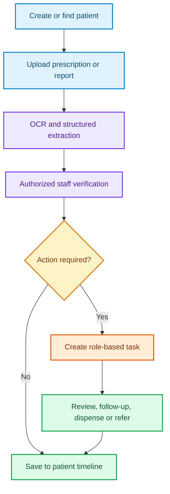

<p align="center">
  
</p>

<div align="center">

# [NAME]

### A connected digital workflow assistant for rural healthcare teams


<br />


<br /><br />

[**Overview**](#overview) •
[**Problem**](#the-problem) •
[**Solution**](#our-solution) •
[**Modules**](#core-modules) •
[**Architecture**](#high-level-architecture) •
[**Roadmap**](#prototype-scope) •
[**Team**](#team)

</div>

---

## Overview

**[NAME]** is a digital healthcare workspace that reduces staff workload by converting prescriptions, medical reports, patient details, follow-ups, and referrals into one simple, connected workflow.

It helps healthcare staff spend less time handling paper, searching for records, making repeated calls, and entering the same information again—and more time caring for patients.

> [NAME] is not a referral-only platform. Referral is one action inside a broader patient-care workflow.

<div align="center">
<table>
  <tr>
    <td align="center" width="25%">📄<br /><b>Digitize</b><br /><sub>Prescriptions and reports</sub></td>
    <td align="center" width="25%">🧑‍⚕️<br /><b>Coordinate</b><br /><sub>Role-based staff tasks</sub></td>
    <td align="center" width="25%">🛡️<br /><b>Support Safely</b><br /><sub>Verified clinical alerts</sub></td>
    <td align="center" width="25%">🔗<br /><b>Connect Care</b><br /><sub>Follow-up and referral</sub></td>
  </tr>
</table>
</div>

---

## SIH 2026 Problem Statement

| Field | Details |
|---|---|
| **Problem Statement ID** | 26133 |
| **Title** | Accessibility and quality of public healthcare services, particularly in rural and underserved areas |
| **Organization** | Government of Maharashtra |
| **Department** | Maharashtra State Innovation Society, Department of Skills, Employment, Entrepreneurship and Innovation |
| **Category** | Software |
| **Theme** | MedTech / BioTech / HealthTech |

The problem statement highlights long travel distances, shortages of specialists, irregular diagnostics, fragmented records, delayed referrals, limited service awareness, staff constraints, low connectivity, language barriers, health literacy, and affordability.

[NAME] addresses the operational side of this challenge by helping frontline workers, doctors, pharmacists, laboratory staff, referral facilities, and supervisors work from one reusable patient record and one shared task flow.

---

## The Problem

Healthcare staff in rural and underserved areas often work across disconnected systems:

```text
Paper records + handwritten prescriptions + separate reports
+ repeated data entry + manual calls + follow-up registers
                              ↓
          Delays, missing information, and staff overload
```

A patient's information may be spread across notebooks, paper files, laboratory reports, prescriptions, phone calls, and messaging apps. Staff repeatedly collect the same details, doctors spend time searching for documents, and important follow-up actions can be delayed or missed.

Digital systems can also increase workload if workers must maintain both paper and digital records or complete long forms. [NAME] is therefore designed around minimal data entry and immediately useful outputs.

---

## Our Solution

```text
Capture patient information once
              ↓
Convert prescriptions and reports into structured data
              ↓
Verify important information with authorized staff
              ↓
Create tasks only when action is required
              ↓
Track care, follow-up, and referral from one workspace
```

### Three Product Pillars

| Pillar | Problem Solved | [NAME] Capability |
|---|---|---|
| **Digitization** | Information is scattered across paper records | Prescription/report OCR and a unified patient profile |
| **Friction Reduction** | Staff repeat work and manually chase actions | One-time data capture, role-based tasks, reminders, and shared timelines |
| **Safe Support** | Important details can be overlooked | Allergy alerts, duplicate medicine checks, verified reports, and clinician-reviewed flags |

---

## How It Works



Every clinical document remains connected to the original patient, the staff member who verified it, and any task created from it.

---

## Core Modules

<div align="center">

| 🗂️ Patient Workspace | 💊 Prescription Intelligence | 🧪 Report Digitization |
|:---:|:---:|:---:|
| One reusable patient timeline | OCR with human verification | Structured values with original proof |

| ✅ Staff Workflow | 🚑 Referral & Handover | 📊 Facility Dashboard |
|:---:|:---:|:---:|
| Clear owner, priority and deadline | Complete summary in one action | Exceptions, workload and follow-up |

</div>

### 1. Unified Patient Workspace

Staff can create or search a patient record and view essential information in one place:

- Basic profile and contact details
- Medical history and previous encounters
- Allergies and current medicines
- Vitals and clinical notes
- Past prescriptions
- Medical reports and important values
- Follow-up status
- Referral and care-handover history
- A chronological patient timeline

The goal is simple: enter information once and allow authorized staff to reuse it instead of asking the patient to repeat the same details.

### 2. Prescription Intelligence

Staff can scan a handwritten or printed prescription. OCR converts it into reviewable fields:

```text
Medicine name | Dose | Frequency | Duration | Instructions
```

After extraction, [NAME] can:

- Flag a possible match with a recorded allergy
- Highlight possible duplicate medicines
- Show common side-effect and warning information in simple language
- Display Jan Aushadhi or generic alternatives for affordability
- Show prototype medicine-availability information using demo data
- Mark unclear OCR text for manual correction

> **Clinician/pharmacist review required.** Extracted information must be verified before it is used in care.

The platform does not prescribe, replace, or recommend medicines directly to a patient.

### 3. Medical Report Digitization

Staff can upload or photograph laboratory reports, discharge summaries, ECG reports, scans, and older test results.

The system can:

- Extract report type, date, facility, and important values
- Preserve the original PDF or image as evidence
- Allow staff to verify or correct extracted data
- Display report history and trends in the patient profile
- Attach relevant reports to a consultation or referral
- Create a task when a report is pending, missing, or unverified
- Flag a value for **clinical review** without diagnosing a disease

Example structured output:

```text
Haemoglobin: 9.2 g/dL — Verified
Blood glucose: 215 mg/dL — Verified
Report date: 23 August 2026
Source: PHC Laboratory
```

### 4. Staff Task Workflow

Each required action becomes a task with an owner, priority, status, and deadline.

| Role | Example Task |
|---|---|
| Doctor | Review medicine-allergy alert |
| Pharmacist | Confirm medicine dispensed |
| Laboratory Staff | Verify extracted report values |
| ANM / Frontline Worker | Complete follow-up visit |
| Receiving Facility | Acknowledge referral |
| Supervisor | Resolve an overdue or escalated case |

This replaces dependence on memory, notebooks, repeated calls, and scattered messages with a short, prioritized worklist.

### 5. Referral and Care Handover

Referral remains important, but it is one action performed from the same patient workspace. A structured referral can automatically include:

- Patient history and current condition
- Vitals
- Relevant reports
- Current and previous prescriptions
- Known allergies
- Referral reason and urgency
- Previous treatment
- Sending and receiving facility details

The receiving facility can acknowledge the case, review the shared summary, update its status, and complete the care handover. This reduces repeated forms, missing paper reports, and avoidable information loss.

### 6. Low-Connectivity and Inclusive Access

The planned experience is designed for rural care settings through:

- Mobile-first and responsive screens
- Minimal required fields
- Save-as-draft and retry support
- Offline-friendly local capture with later synchronization
- Multilingual labels and patient instructions
- Large touch targets and simple language
- Clear sync, verification, and pending states

### 7. Facility and Supervisor Dashboard

Authorized supervisors can monitor:

- Pending and overdue tasks
- Unverified prescriptions and reports
- Referral acknowledgement and completion
- Follow-up completion
- Medicine and diagnostic availability indicators
- Staff workload and exception queues
- Facility-level service trends

---

## Role-Based Experience

| User | Primary Actions |
|---|---|
| **Frontline Worker / ANM** | Register patients, capture vitals, upload documents, complete follow-ups |
| **Doctor / RMP** | Review patient history, verify alerts, make clinical decisions, create referrals |
| **Pharmacist** | Verify prescription details, record dispensing, update medicine availability |
| **Laboratory Staff** | Upload reports, verify extracted values, mark reports complete |
| **Referral Facility Staff** | Acknowledge referrals, review care summaries, update handover status |
| **Supervisor / Admin** | Manage access, monitor delays, review workloads, and handle escalations |

---

## Prototype Scope

### Phase 1 — Build Now

The hackathon prototype focuses on transparent, rule-based assistance:

- Patient registration, search, and unified timeline
- Prescription and report upload
- OCR-based structured extraction
- Staff correction and verification
- Allergy-match alert
- Duplicate-medicine warning
- Missing or unverified report reminder
- Rule-based green, amber, and red priority flags
- Role-based task assignment and overdue alerts
- Structured referral generation and acknowledgement
- Demo medicine and diagnostic availability
- Supervisor exception dashboard

### Phase 2 — Future Clinical Decision Support

With properly consented, anonymized, clinically reviewed, and representative data, future models may help clinicians:

- Predict patients at risk of missing follow-up
- Prioritize reports requiring faster review
- Identify missing information in patient records
- Suggest protocol-based care-workflow checklists
- Detect possible duplicate or inconsistent data entries
- Support risk prioritization for authorized clinical staff

> Future AI will support clinicians—not replace their judgement. The responsible clinician remains in control of diagnosis, counselling, treatment, and prescription.

---

## Clinical Safety Guardrails

[NAME] is designed as workflow and decision-support software, not an autonomous diagnostic or prescribing system.

- No automatic diagnosis
- No autonomous prescription or medicine replacement
- No direct-to-patient medicine recommendation
- Human verification for OCR-extracted clinical information
- Visible confidence and unverified states
- Clinician/pharmacist confirmation for medicine-related alerts
- Original documents retained for comparison
- Role-based access to sensitive patient information
- Audit trail for important changes and decisions
- Clear emergency escalation instead of algorithmic reassurance

---

## Proposed Technology Stack

> The stack may be adjusted during prototype development.

| Layer | Proposed Technologies |
|---|---|
| **Frontend** | React, TypeScript, Tailwind CSS, Progressive Web App support |
| **Backend** | Node.js, Express.js, REST APIs |
| **Database** | MongoDB |
| **Document Processing** | OCR engine with confidence scoring and manual review |
| **Authentication** | Role-based access control with secure sessions/JWT |
| **Notifications** | In-app reminders with optional SMS/email integration |
| **Storage** | Encrypted object storage for original reports and prescriptions |
| **Interoperability** | FHIR-aligned resource design and ABDM-compatible integration direction |
| **Deployment** | Cloud-hosted services with offline-first client support |

ABDM/FHIR compatibility is an architectural direction and does not imply certification or production integration in the hackathon prototype.

---

## High-Level Architecture

| Layer | Responsibility |
|---|---|
| **Care Interface** | Patient search, document capture, tasks, referral, dashboard |
| **Workflow API** | Authentication, permissions, tasks, alerts, referrals, audit trail |
| **Document Intelligence** | OCR, field extraction, confidence score, verification queue |
| **Clinical Rules** | Transparent allergy, duplication, missing-data, and overdue checks |
| **Patient Data Store** | Profiles, encounters, medicines, allergies, reports, and timeline |
| **File Store** | Original prescription/report images and PDFs |
| **Integration Layer** | Future FHIR/ABDM, notification, facility, and medicine-data connectors |

---

## Privacy and Security Principles

- Obtain informed consent for collection and sharing of patient information
- Collect only information required for the care workflow
- Use role-based and least-privilege access
- Encrypt sensitive information in transit and at rest
- Maintain audit logs for access and important record changes
- Set retention and deletion policies appropriate to healthcare records
- Use synthetic or properly anonymized data for demonstrations and model development
- Avoid exposing patient data in logs, analytics, screenshots, or public repositories

---

## Expected Impact

| Outcome | Example Measurement |
|---|---|
| Less repeated work | Reduction in duplicate data entry per patient encounter |
| Faster information access | Time required to find prescriptions and reports |
| Better continuity | Percentage of encounters with a complete reusable summary |
| Safer review | Percentage of flagged items acknowledged by authorized staff |
| Improved follow-up | On-time completion rate for assigned follow-up tasks |
| Stronger referrals | Referral acknowledgement and completion rate |
| Lower administrative burden | Average time spent on paperwork and manual coordination |

---

## What Makes [NAME] Different?

Many healthcare products solve one isolated task. [NAME] connects the daily work around the patient:

```text
Patient record
   ├── Prescription intelligence
   ├── Report digitization
   ├── Staff tasks and reminders
   ├── Medicine/diagnostic visibility
   ├── Follow-up tracking
   └── Referral and care handover
```

The product's value is not simply storing documents. It turns verified information into the next clear action for the right staff member.

---

## Development Status

🚧 **Hackathon prototype in development**

The current goal is to demonstrate the complete patient-to-task workflow using synthetic patient records, sample prescriptions/reports, transparent rule-based alerts, and demo facility data.

---

## Team

**Logic Coders**

| Profile | Name | Role | GitHub |
|:---:|---|---|---|
|  | **Naitik** | **Team Leader** | [@hellonaitikdas-max](https://github.com/hellonaitikdas-max) |
|  | **Dev** | Team Member | [@D3VSONI](https://github.com/D3VSONI) |
|  | **Abhay** | Team Member | [@abhi-og](https://github.com/abhi-og) |
|  | **Prajan** | Team Member | [@prajanexists-lang](https://github.com/prajanexists-lang) |
|  | **Ashutosh** | Team Member | [@Ashu-dev0](https://github.com/Ashu-dev0) |
|  | **Adrika** | Team Member | [@adrika-des](https://github.com/adrika-des) |

---

## Responsible-Use References

- [WHO: Recommendations on digital interventions for health system strengthening](https://www.who.int/publications/i/item/9789241550505)
- [Telemedicine Practice Guidelines in India: review and implementation discussion](https://pmc.ncbi.nlm.nih.gov/articles/PMC8106416/)

---

## Disclaimer

[NAME] is an early-stage hackathon prototype. It is not a medical device, does not provide a diagnosis, and must not be used as a substitute for a qualified healthcare professional, an approved clinical protocol, or an emergency service. All prototype medicine, report, availability, and patient data should be treated as demonstration data unless explicitly verified by an authorized professional.

---

<div align="center">

### [NAME]

**Less paperwork. Clearer workflows. More time for patient care.**

Built for **Smart India Hackathon 2026 — Problem Statement 26133**

</div>

<p align="center">
  
</p>
